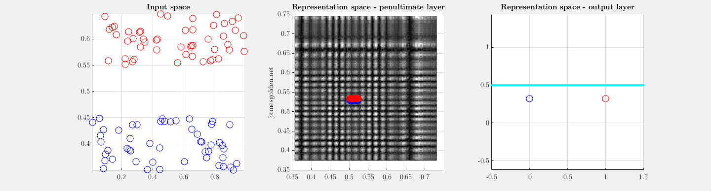

# A deep network learns to classify low-dimensional data by warping input space

“…Trained networks… contract space at the center of decision volumes and expand space in the vicinity of decision boundaries” – Nayebi & Ganguli, 2017

y = sig(W*x), z = sig(V*y) undergoing supervised training to separate blue and red, adapted from Olshausen, 2010. Inspired by Fig 6 of [Olshausen & Field 2005](http://www.rctn.org/bruno/CTBP/olshausen-field05.pdf) (see bottom for appendix) and [Olah 2014](http://colah.github.io/posts/2014-03-NN-Manifolds-Topology/). 

These data points are linearly separable and can be classified simply by placing the decision boundary at the correct place. However, using a two-layer network (which is unnecessary) shows how the space at the decision boundary is expanded.

In order to correctly classify these data points in a 2D space as red or blue, a supervised two-layer network needs three feature vectors in the first layer (W; green, magenta and yellow) (Olah, 2014). If the projections onto those three feature vectors are plotted in a representation space where the features are orthogonal, we can observe how the network learns to warp the 2D input space lattice in 3D representation space in order to make classification possible with a single plane (blue cyan points), where projection onto a vector normal to the cyan plane separates the two classes (rightmost panel).

Learning feature vectors in W is equivalent to warping the input space within the representation space, and learning feature vector V is the placement of the separating plane (cyan points). Convolutional networks do something like this in high dimensions to classify images, and measurements of the local curvature of the input space reveal how individual neurons and layers contribute to successful recognition.

The network is described by these equations for the two layers: y = sig(W*x), z = sig(V*y), where sig is a sigmoid nonlinearity. The data is limited to the (0,1) cube by the sigmoid function.

When the classes are randomized, a deeper network with two hidden layers of 16 units (projected back into a penultimate layer of 3 units) is almost powerful enough to "memorize" a dataset by extreme warping of the input data space. Note that at the end a number of points are still classified incorrectly.

For data in a 3D input space, the process is similar:

[Olshausen & Field, 2005, Figure 6](http://www.rctn.org/bruno/CTBP/olshausen-field05.pdf): Overcomplete representation in a sparse coding network. (A) The iso-response contours of three
linear neurons (with half-wave rectification) having linearly dependent weight
vectors. A stimulus falling anywhere along a given contour will result in the
same response from the neuron. A stimulus falling in the upper half-plane will
result in responses on all three neurons, even though only two would be required
to uniquely determine its position in the space. (B) Curving the response
contours removes redundancy among these neurons. Now only two neurons
will code for a stimulus anywhere in this space. (C) A full tiling of the 2D stimulus
space now requires eight neurons, which would be overcomplete as a linear
code, but critically sampled given this form of nonlinear response.

